[🇧🇷 Português](README.md) | 🇺🇸 English

# 🚦 Exploratory Data Analysis — Federal Highway Accidents in Brazil (2025)

Exploratory Data Analysis (EDA) project on accidents recorded on Brazilian federal highways in 2025, based on open data from the **Federal Highway Police (PRF)**.

---

## 📋 About the Dataset

| Attribute | Detail |
|---|---|
| **Source** | [Federal Highway Police — Open Data](https://www.gov.br/prf/pt-br/acesso-a-informacao/dados-abertos) |
| **File** | `datatran2025.csv` |
| **Records** | 72,529 accidents |
| **Columns** | 30 variables |
| **Period** | January to December 2025 |
| **Separator** | `;` (semicolon) |
| **Encoding** | `latin1` |

### Main variables analyzed

| Variable | Description |
|---|---|
| `uf` | State where the accident occurred |
| `causa_acidente` | Registered cause of the accident |
| `condicao_metereologica` | Weather condition at the time of the accident |
| `fase_dia` | Time of day (Dawn, Daytime, Dusk, Night) |
| `dia_semana` | Day of the week |
| `mortos` | Number of fatalities |
| `feridos_leves` | Number of minor injuries |
| `feridos_graves` | Number of serious injuries |
| `pessoas` | Total people involved |
| `classificacao_acidente` | Fatal / Injured / No Victims |

---

## 📁 Project Structure

```
datatran2025/
│
├── 01_limpeza.py                 # Data loading, cleaning and type conversion
├── 02_eda.py                     # Initial Exploratory Analysis (6 charts)
├── 03_analises_avancadas.py      # Correlations and heatmaps (5 charts)
├── datatran2025.csv              # Raw dataset, PRF Accidents 2025
│
├── outputs/                      # Generated charts
│   ├── grafico_acidentes_por_uf.png
│   ├── grafico_top_causas.png
│   ├── grafico_distribuicao_mortos.png
│   ├── grafico_acidentes_dia_semana.png
│   ├── grafico_fase_dia.png
│   ├── grafico_evolucao_mensal.png
│   ├── correlacao_meteo_taxa_mortalidade.png
│   ├── correlacao_meteo_classificacao_stacked.png
│   ├── correlacao_meteo_heatmap_mortos.png
│   ├── heatmap_uf_dia_absoluto.png
│   └── heatmap_uf_dia_normalizado.png
│
├── requirements.txt              # Project dependencies
├── .gitignore                    # Git ignored files
└── README.md                     # This file
```

---

## 🚀 How to Run

### 1. Clone the repository

```bash
git clone https://github.com/Nickolas3211/datatran2025.git
cd datatran2025
```

### 2. Install dependencies

```bash
pip install -r requirements.txt
```

### 3. Create the outputs folder

```bash
mkdir outputs
```

### 4. Run the scripts in order

```bash
python 01_limpeza.py
python 02_eda.py
python 03_analises_avancadas.py
```

> The dataset is loaded automatically from this repository. No separate download needed.

> Scripts can also be run directly in **Spyder**. Just open each file and press F5.

---

## 📊 Analyses and Results

### 1. Accidents by State (UF)

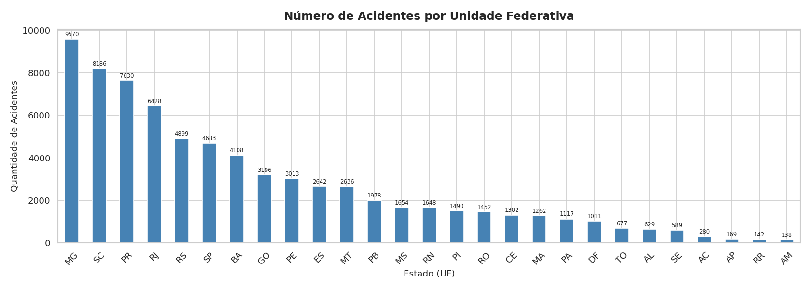

Minas Gerais leads by a wide margin (9,570 accidents), followed by Santa Catarina (8,186) and Paraná (7,630). Together, these three states account for more than **34% of all accidents in the country**. This volume does not necessarily mean these states are more dangerous. MG, for example, has one of the largest federal highway networks in Brazil. A fairer analysis would cross-reference accident counts with kilometers of highway per state.

---

### 2. Top 10 Accident Causes

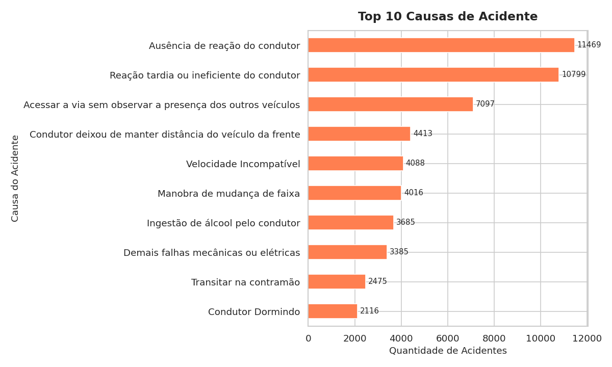

The top two causes stand out: "No driver reaction" (11,469) and "Late or inefficient reaction" (10,799), together accounting for over 22,000 accidents, nearly **30% of the total**. In practice, both point to the same problem: distracted driving, which today includes phone use and fatigue. **Alcohol consumption** ranks 7th with 3,685 cases, a significant number given that it is 100% preventable.

---

### 3. Distribution of Fatalities per Accident

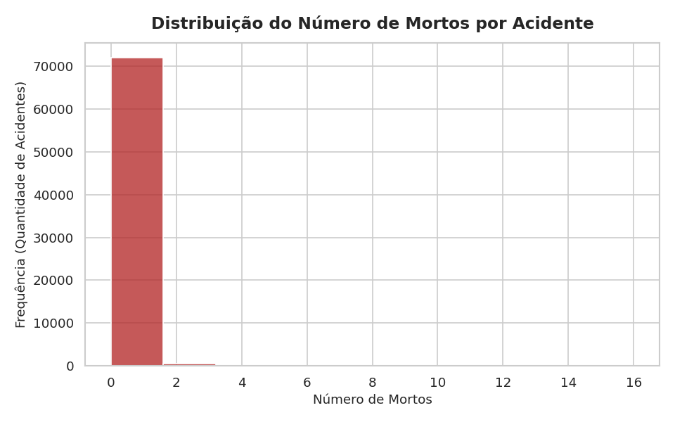

The chart shows a right-skewed distribution: the vast majority of accidents fall in the zero bar. **92.8% of accidents had no fatalities**, but the 7.2% that did resulted in over **6,000 deaths**, with extreme cases of up to 16 fatalities in a single accident. This shows that while fatal accidents are rare, they tend to be severe.

---

### 4. Accidents by Day of the Week

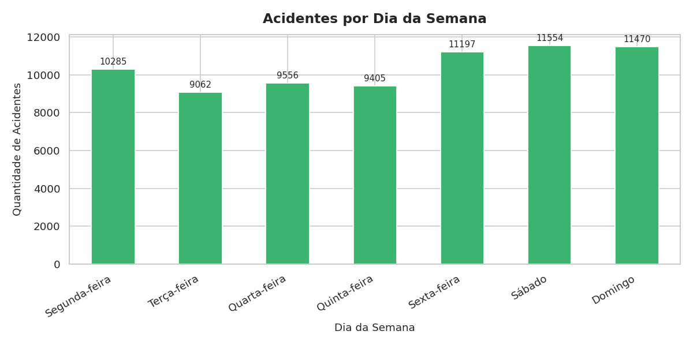

Friday, Saturday, and Sunday concentrate the highest volumes, peaking on **Saturday (11,554 accidents)**. Monday through Thursday remain lower and more stable, around 9,000 to 10,000. This pattern reflects people's behavior: higher mobility on weekends, longer trips, and greater alcohol consumption.

---

### 5. Accidents by Time of Day

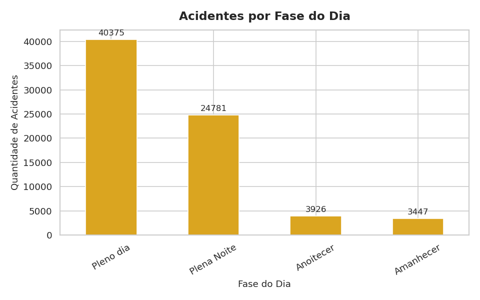

Daytime dominates with 40,375 accidents (55% of total), which is expected given higher traffic volume. The most concerning figure is second place: **Night with 24,781 accidents**, a disproportionately high share for a period with far less traffic. This suggests that nighttime is inherently more dangerous, likely due to reduced visibility, fatigue, and higher alcohol incidence.

---

### 6. Monthly Accident Trend

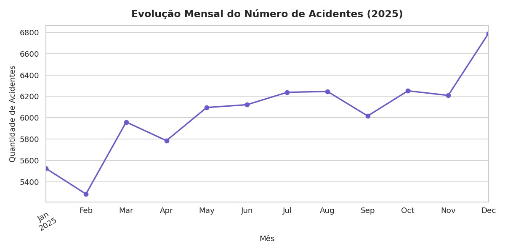

January and February recorded the lowest volumes (5,528 and 5,287). From March onward, numbers rise and stabilize between 6,000 and 6,300 per month, with a **peak in December (6,788)**, the month of highest road activity due to year-end holidays. The upward trend throughout the year may reflect both a real increase in accidents and improvements in reporting.

---

### 7. Mortality Rate by Weather Condition

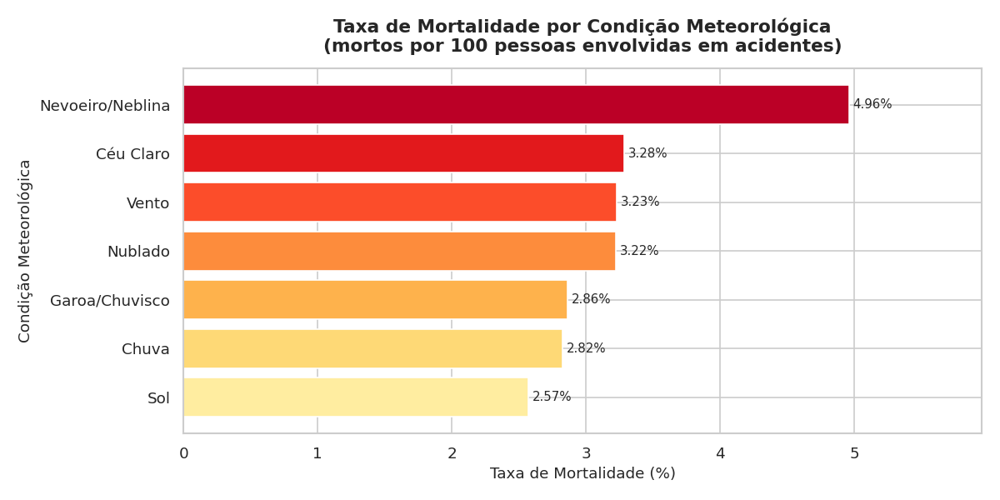

**Fog/Mist leads by a wide margin (~5%)**, well above rain (~2.8%), a counter-intuitive result, as rain is more commonly associated with serious accidents. The explanation lies in visibility: fog drastically reduces the driver's field of vision, catching them off guard. Clear sky conditions show a lower rate, precisely because they represent the highest traffic volume and best visibility.

---

### 8. Accident Classification by Weather Condition (%)

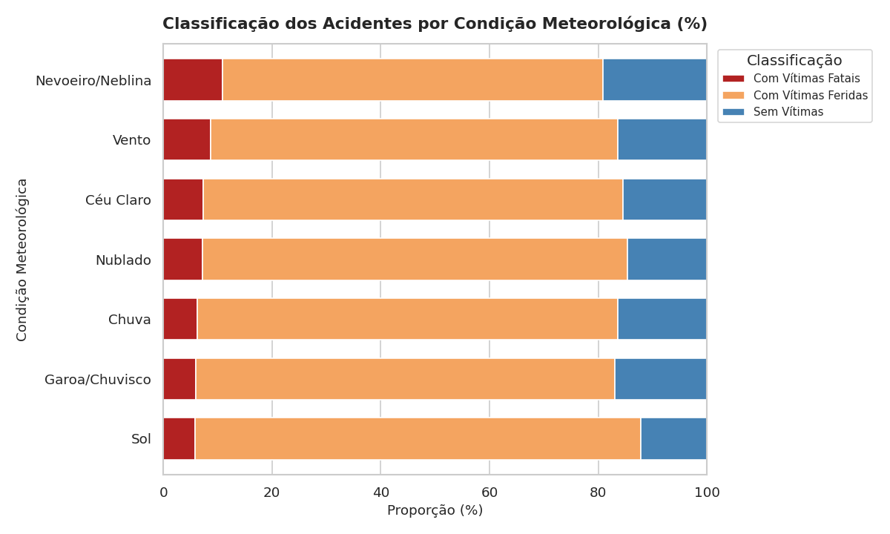

This chart shows the proportion of fatal, injury, and no-victim accidents for each weather condition. It allows a visual comparison of the "weight" of each category, confirming that conditions like fog and hail, despite lower absolute volumes, concentrate a higher proportion of fatal accidents relative to their total.

---

### 9. Fatalities by Weather Condition and Time of Day

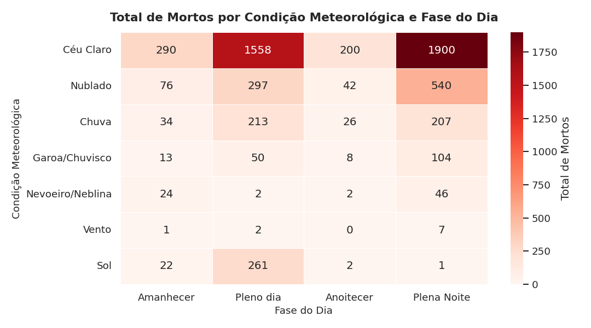

The cross-analysis of weather condition and time of day reveals that **clear sky during daytime concentrates the highest absolute number of deaths**, a direct reflection of traffic volume. However, when analyzed proportionally, fog at night stands out as the deadliest combination. The heatmap makes clear that these factors amplify each other: poor visibility combined with nighttime creates the most dangerous conditions.

---

### 10. Accident Volume by State and Day of the Week

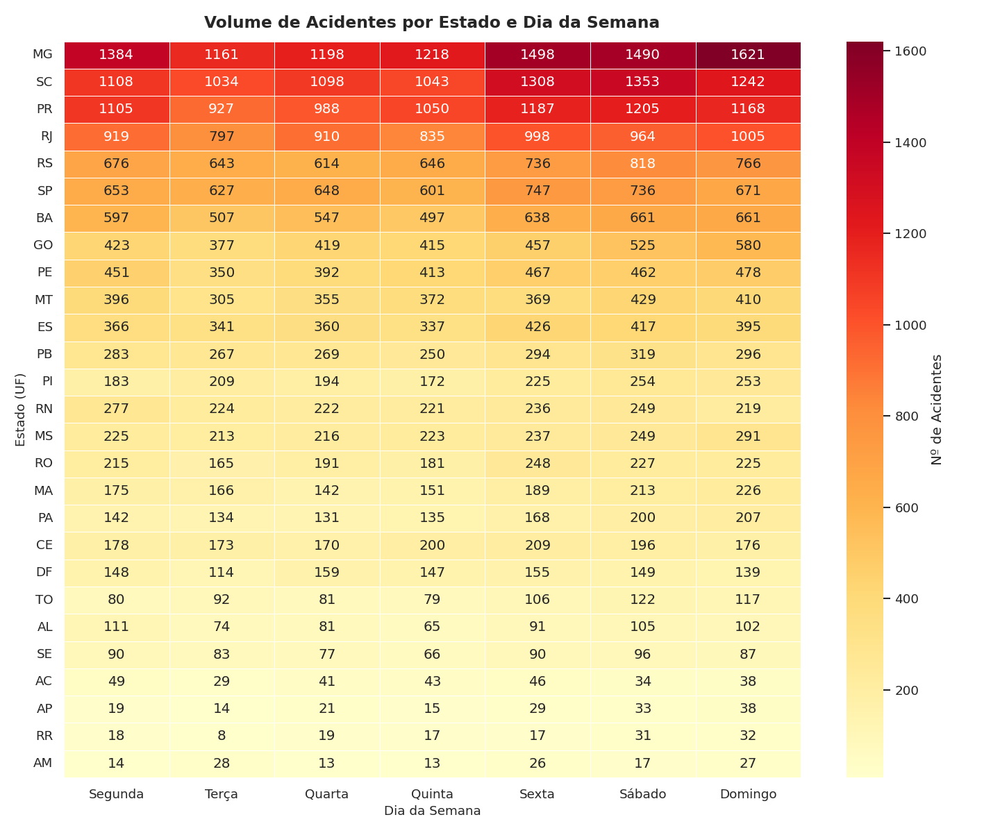

The absolute volume heatmap confirms the dominance of MG, SC, and PR across all days of the week. Saturday is consistently the most critical day in most states. Smaller states like RR and AP record low volumes throughout the week, while SP shows a more uniform distribution across days.

---

### 11. Accident Distribution (%) by State and Day of the Week

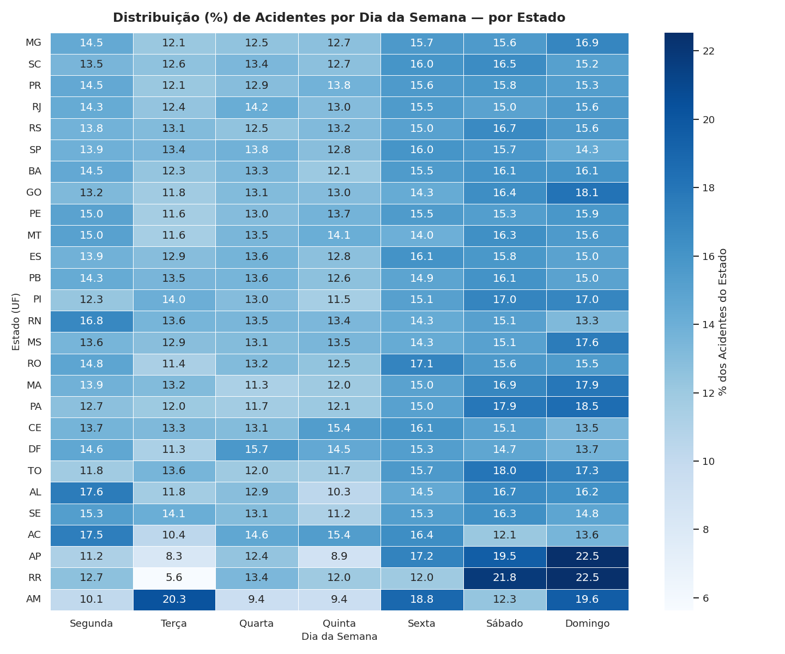

By normalizing per state (each row sums to 100%), we remove the size effect and focus on each state's **weekly pattern**. The distribution is relatively uniform across states. All of them concentrate between 13% and 16% of their accidents on Saturday, indicating that the weekend peak is a nationwide phenomenon, not restricted to specific states.

---

## 🛠️ Technologies Used

- **Python 3.x**
- **pandas** — data manipulation and analysis
- **matplotlib** — chart construction
- **seaborn** — styling and statistical graphics

---

## 👤 Author

**Nickolas Santana**  
[LinkedIn](https://www.linkedin.com/in/nickolas-mateus-225587260/) • [GitHub](https://github.com/Nickolas3211)
